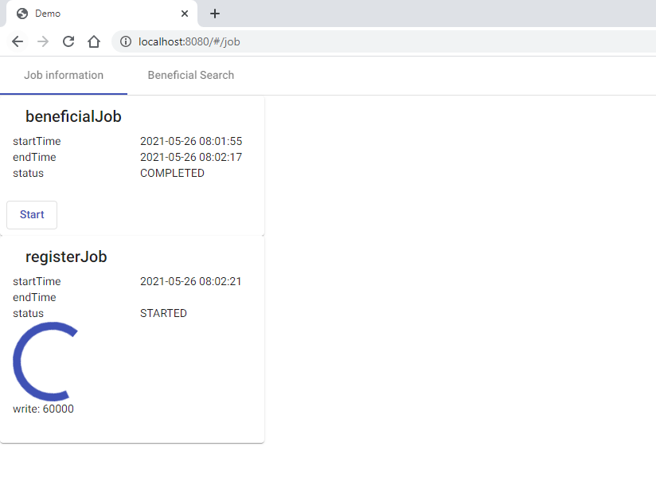
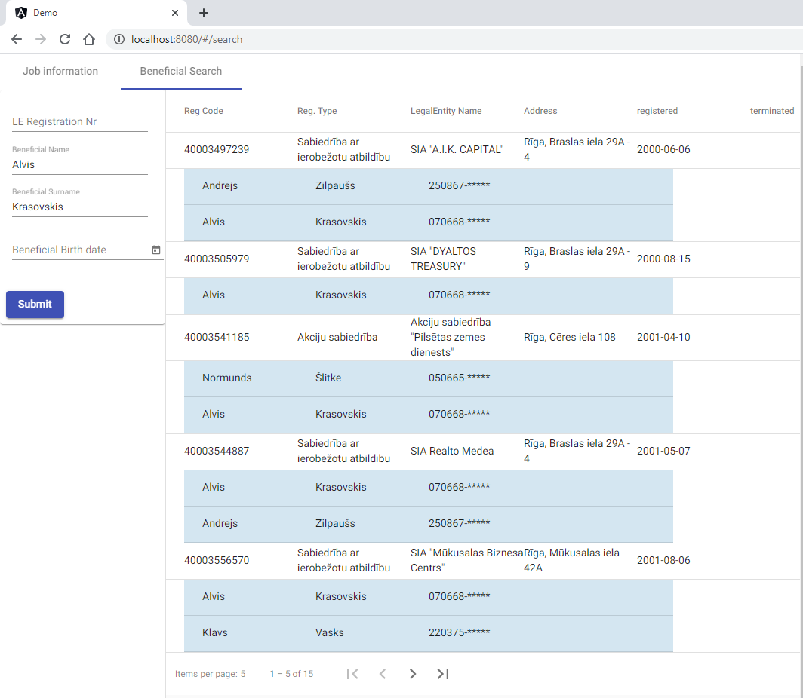

# Demo App

### build
mvn install

### run
java -jar target/demo-0.0.1-SNAPSHOT.jar

**rest api**

- /api/jobs - Get names of all registered jobs 
- /api/jobs/{name} - Get info about job by name
- /api/jobs/{name} - Post request to start new job by name

- /api/registers/ - Spring rest CRUD functional
- /api/beneficials/ - Spring rest CRUD functional
- /api/registers/search/findByParams - find legal entity by optional params
  - projection=registers
  - page page index
  - size items per page
  - regCode (used sql LIKE)
  - foreName (used sql LIKE)
  - surName (used sql LIKE)
  - birthDate